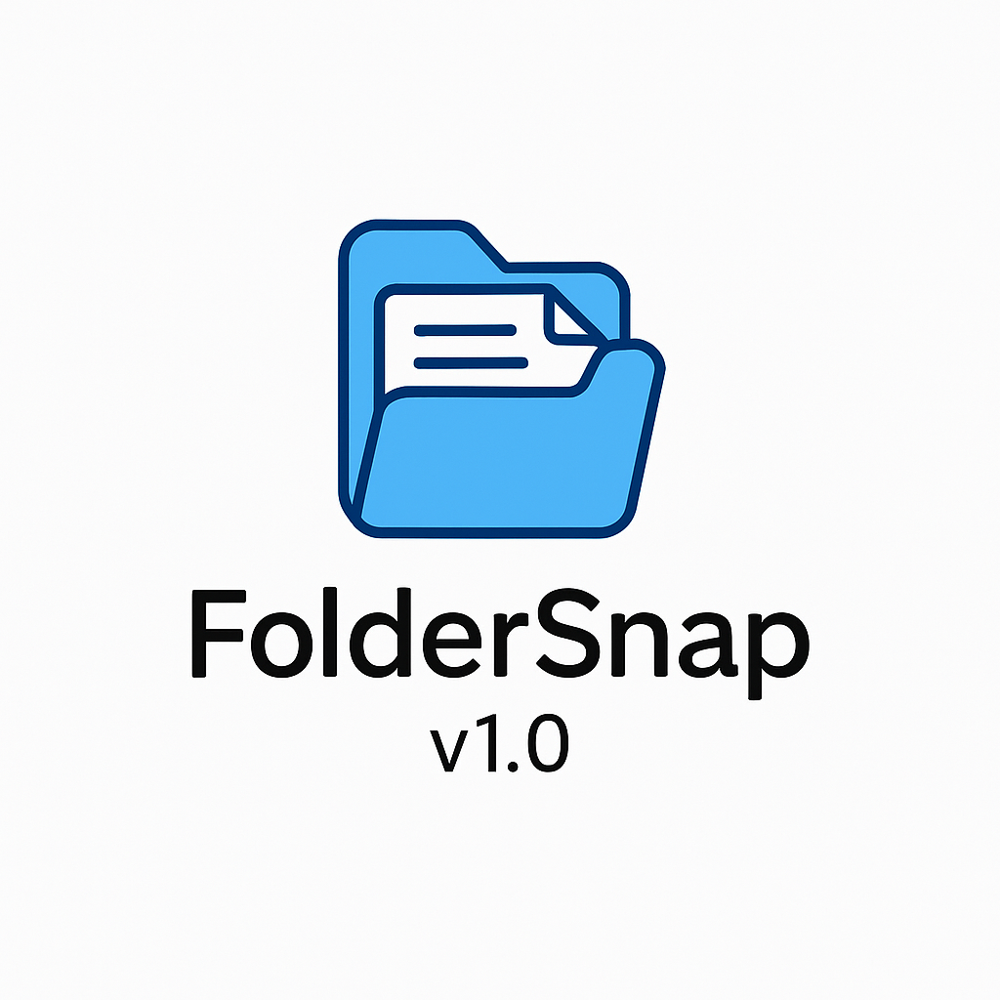

# 📂 FolderSnap

**FolderSnap** é um aplicativo simples e intuitivo que permite criar estruturas completas de pastas com apenas alguns cliques. Ideal para organizar projetos, clientes, documentos ou qualquer outro tipo de conteúdo que exija uma hierarquia de pastas recorrente.



---

## ✨ Funcionalidades

- Interface gráfica amigável (GUI) com botões e campos de texto
- Criação automática de múltiplas pastas com base em um arquivo `.txt`
- Seleção manual do arquivo de estrutura e da pasta de destino
- Feedback visual com mensagens de erro ou sucesso
- Splash screen com logotipo e número da versão
- Compatível com Windows (versão .exe incluída via PyInstaller)

---

## 📁 Exemplo de estrutura `.txt`

```txt
Projetos
Projetos/2025
Projetos/2025/Cliente A
Projetos/2025/Cliente A/Contratos
Projetos/2025/Cliente A/Entrega Final
Projetos/2025/Cliente B
Projetos/2025/Cliente B/Referências
Financeiro
Financeiro/Orçamentos
Financeiro/Notas Fiscais
Pessoal
Pessoal/Viagens
Pessoal/Documentos
🚀 Como executar
1. Com Python instalado
bash
Copiar
Editar
python foldersnap.py
2. Versão executável (.exe)
Abra o arquivo FolderSnap.exe dentro da pasta /dist (sem precisar de Python).

🧱 Tecnologias
Python 3.10

Tkinter (GUI)

Pillow (splashscreen)

PyInstaller (empacotamento para .exe)

📌 Roadmap
 Splashscreen com logo

 Interface simples e funcional

 Suporte a múltiplos modelos de estrutura

 Salvamento e carregamento de modelos personalizados

 Histórico de uso recente

 Modo escuro
